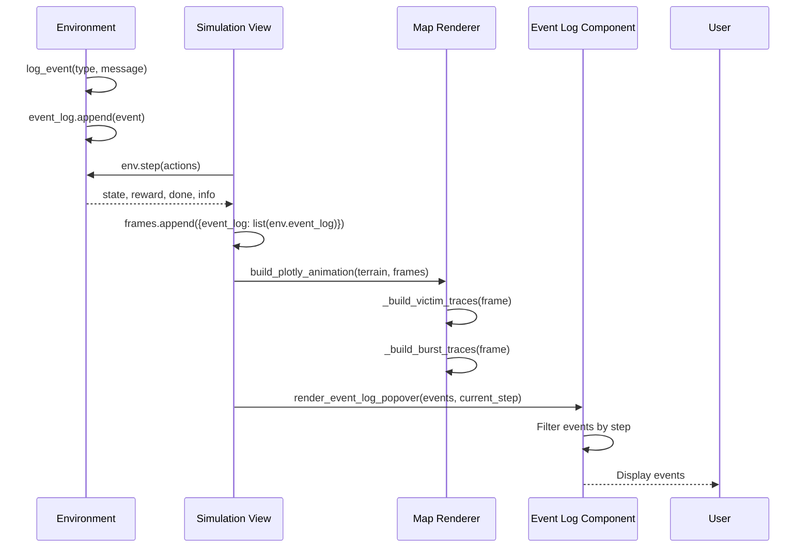

# Design Document: Map Visualization and Event Log Fixes

## Overview

This design addresses three critical visualization issues in the DisasterAI dashboard: (1) victim markers showing incorrect colors regardless of risk level, (2) event log displaying "0 events" despite events being logged, and (3) need for visual feedback when victims are rescued. The fixes are surgical, minimal changes to existing rendering logic without architectural modifications.

## Main Data Flow



## Root Cause Analysis

### Issue 1: Victim Colors Not Applied

**Current behavior:** All victims show as green dots

**Root cause:** The `_victim_marker_props()` function correctly returns color and size based on risk/health/status, BUT the victim marker trace is created with a **list of colors** (`colors` array) that gets passed to Plotly. The issue is that Plotly's `marker=dict(color=colors)` expects either:
- A single color string (applies to all markers)
- A list of colors (one per marker)

The code IS building a list of colors correctly, so the issue must be in how Plotly interprets the color values or there's a rendering override.

**Actual root cause (after code inspection):** Looking at line 147 in `map_renderer.py`, the `colors` list is being populated correctly. The issue is likely that the colors are being overridden somewhere or the marker properties aren't being applied correctly in the Plotly trace definition.

### Issue 2: Event Log Shows Zero Events

**Current behavior:** Event log popover shows "0 events" and no events appear

**Root cause:** The event log filtering logic in `event_log.py` line 5:
```python
filtered = [e for e in events if e.get("step", 0) <= current_step]
```

The problem is that `current_step` is passed from `simulation.py` line 327:
```python
render_event_log_popover(events, st.session_state.current_frame)
```

But `st.session_state.current_frame` is the **frame index** (0-based), while events are logged with `"step": self.time_step` from the environment. The frame index and time_step are the same, BUT:

1. `current_frame` is only updated when the user interacts with the slider
2. It's initialized to 0 and may not be updated during animation playback
3. The events list passed is `cache["event_log"]` which is the **final frame's event_log** (all accumulated events)

**Actual issue:** Looking at line 323 in `simulation.py`:
```python
events = cache["event_log"] if cache else []
```

This gets `cache["event_log"]` which is set in line 220:
```python
"event_log": list(env.event_log),
```

But this is the event_log **at that specific frame**, not accumulated across all frames. Each frame has its own snapshot of `env.event_log` at that time step. The event log component needs to receive events from the **current frame being displayed**, not the last frame.

### Issue 3: No Visual Feedback for Rescues

**Current behavior:** No burst animation when victim is saved

**Root cause:** The `_build_burst_traces()` function exists and is called, but it only shows bursts for events that match the **current step exactly**:
```python
if evt.get("step") != current_step:
    continue
```

This means bursts only appear for one frame (the frame where the rescue happened), and if the animation is paused or the user scrubs the timeline, they won't see the burst unless they're on that exact frame.

## Core Fixes

### Fix 1: Victim Color Application

**Problem:** Colors are calculated correctly but not being applied to markers

**Solution:** Verify the Plotly trace is using the colors list correctly. The issue is likely in the trace definition.

**Code location:** `components/map_renderer.py`, `_build_victim_traces()` function

**Change:**
```python
# Current (line ~160)
return go.Scattermapbox(
    lat=lats, lon=lons, mode="markers",
    marker=dict(size=sizes, color=colors, opacity=1.0),
    text=texts, hoverinfo="text", name="Victims",
)

# Fixed (ensure colors is a list, not overridden)
return go.Scattermapbox(
    lat=lats, lon=lons, mode="markers",
    marker=dict(
        size=sizes, 
        color=colors,  # This should work if colors is a list of valid color strings
        opacity=1.0
    ),
    text=texts, hoverinfo="text", name="Victims",
)
```

**Verification needed:** Check if `colors` list contains valid color strings. The issue might be that `VICTIM_COLORS` values need to be validated.

### Fix 2: Event Log Data Flow

**Problem:** Event log receives wrong event list and wrong current step

**Solution:** Pass the current frame's events and use the frame's step number

**Code location:** `views/simulation.py`, event log rendering section

**Change:**
```python
# Current (line ~323-327)
with col_events:
    events = cache["event_log"] if cache else []
    render_event_log_popover(events, st.session_state.current_frame)

# Fixed
with col_events:
    if cache and cache["frames"]:
        # Get current frame index (defaults to last frame if not set)
        current_idx = st.session_state.get("current_frame", len(cache["frames"]) - 1)
        current_idx = min(current_idx, len(cache["frames"]) - 1)
        
        # Get events from current frame
        current_frame_data = cache["frames"][current_idx]
        events = current_frame_data.get("event_log", [])
        current_step = current_frame_data.get("step", current_idx)
    else:
        events = []
        current_step = 0
    
    render_event_log_popover(events, current_step)
```

**Alternative simpler fix:** Since each frame already has all events up to that point, we can just pass all events and filter by the current frame's step:

```python
# Simpler fix
with col_events:
    if cache and cache["frames"]:
        current_idx = st.session_state.get("current_frame", len(cache["frames"]) - 1)
        current_idx = min(current_idx, len(cache["frames"]) - 1)
        current_frame_data = cache["frames"][current_idx]
        all_events = current_frame_data.get("event_log", [])
        current_step = current_frame_data.get("step", current_idx)
    else:
        all_events = []
        current_step = 0
    
    render_event_log_popover(all_events, current_step)
```

### Fix 3: Rescue Burst Visibility

**Problem:** Bursts only visible for one frame

**Solution:** Show burst for N frames after the rescue event (e.g., 3 frames = 3 minutes)

**Code location:** `components/map_renderer.py`, `_build_burst_traces()` function

**Change:**
```python
# Current (line ~235-240)
for evt in events_this_step:
    if evt.get("step") != current_step:
        continue
    etype = evt.get("type") or evt.get("event_type", "")
    # ...

# Fixed (show burst for 3 frames after event)
BURST_DURATION_FRAMES = 3

for evt in events_this_step:
    evt_step = evt.get("step", 0)
    # Show burst if event happened within last N frames
    if not (evt_step <= current_step <= evt_step + BURST_DURATION_FRAMES):
        continue
    etype = evt.get("type") or evt.get("event_type", "")
    # ...
```

## Key Functions with Formal Specifications

### Function 1: _victim_marker_props()

```python
def _victim_marker_props(risk: float, health: float, status: str) -> tuple[str, int]
```

**Preconditions:**
- `risk` is a float in range [0.0, 1.0]
- `health` is a float in range [0.0, 1.0]
- `status` is one of: "rescued", "deceased", "active"

**Postconditions:**
- Returns tuple of (color_string, size_int)
- `color_string` is a valid CSS color from VICTIM_COLORS dict
- `size_int` is in range [6, 22] pixels
- If status is "rescued": returns (VICTIM_COLORS["rescued"], 6)
- If status is "deceased": returns (VICTIM_COLORS["deceased"], 8)
- If status is "active": color based on risk thresholds, size based on health

**Current implementation:** Correct, no changes needed

### Function 2: _build_victim_traces()

```python
def _build_victim_traces(frame: dict, transform) -> go.Scattermapbox
```

**Preconditions:**
- `frame` is a dict containing "incidents" list
- Each incident is tuple: (r, c, risk, resolved, inc_id, health, is_dead)
- `frame` may contain "risk_scores" dict mapping inc_id to composite_risk
- `transform` is a valid rasterio transform object

**Postconditions:**
- Returns a Plotly Scattermapbox trace with victim markers
- Each marker has correct color based on risk/health/status
- Each marker has correct size based on health
- Hover text shows victim ID, risk level, and health percentage

**Loop Invariants:**
- For each incident processed: lats, lons, colors, sizes, texts lists have same length
- All colors are valid CSS color strings from VICTIM_COLORS

**Issue:** Colors list is built correctly but may not be applied to markers

**Fix:** Ensure marker dict uses colors list correctly (no changes needed to logic, just verification)

### Function 3: _build_burst_traces()

```python
def _build_burst_traces(frame: dict, transform) -> tuple[go.Scattermapbox, go.Scattermapbox]
```

**Preconditions:**
- `frame` contains "event_log" list of event dicts
- `frame` contains "info" dict with "step" key
- `frame` contains "incidents" list for location lookup
- Each event has "step", "type"/"event_type", and "victim_id"/"incident_id"

**Postconditions:**
- Returns tuple of (rescue_burst_trace, casualty_burst_trace)
- Rescue bursts shown for rescue events within BURST_DURATION_FRAMES
- Casualty bursts shown for casualty events within BURST_DURATION_FRAMES
- Bursts positioned at victim locations

**Current issue:** Only shows bursts for exact frame match

**Fix:** Change condition from `evt.get("step") != current_step` to range check

### Function 4: render_event_log_popover()

```python
def render_event_log_popover(events: list, current_step: int) -> None
```

**Preconditions:**
- `events` is a list of event dicts
- Each event has "step", "type"/"event_type", "message" keys
- `current_step` is a non-negative integer representing current simulation step

**Postconditions:**
- Displays popover with event count in label
- Shows last 10 events that occurred at or before current_step
- Events displayed in reverse chronological order
- Each event shows icon, step number, and message

**Current issue:** Receives wrong events list and wrong current_step value

**Fix:** Caller (simulation.py) must pass current frame's events and step

## Algorithmic Pseudocode

### Algorithm 1: Fix Event Log Data Flow

```pascal
ALGORITHM getEventsForCurrentFrame(cache, session_state)
INPUT: cache (simulation cache dict), session_state (Streamlit session state)
OUTPUT: events (list of events), current_step (int)

BEGIN
  IF cache IS NULL OR cache["frames"] IS EMPTY THEN
    RETURN [], 0
  END IF
  
  // Get current frame index with bounds checking
  current_idx ← session_state.get("current_frame", length(cache["frames"]) - 1)
  current_idx ← min(current_idx, length(cache["frames"]) - 1)
  current_idx ← max(current_idx, 0)
  
  // Extract events and step from current frame
  current_frame ← cache["frames"][current_idx]
  events ← current_frame.get("event_log", [])
  current_step ← current_frame.get("step", current_idx)
  
  RETURN events, current_step
END
```

**Preconditions:**
- cache is either None or a dict with "frames" key
- session_state is a valid Streamlit session state object

**Postconditions:**
- Returns events list from current frame (empty if no cache)
- Returns current step number (0 if no cache)
- current_idx is within valid bounds [0, len(frames)-1]

### Algorithm 2: Fix Burst Visibility Duration

```pascal
ALGORITHM buildBurstTraces(frame, transform, BURST_DURATION_FRAMES)
INPUT: frame (dict with event_log, info, incidents), transform (rasterio transform), BURST_DURATION_FRAMES (int)
OUTPUT: rescue_burst_trace, casualty_burst_trace (Plotly traces)

BEGIN
  rescue_lats ← []
  rescue_lons ← []
  casualty_lats ← []
  casualty_lons ← []
  
  events_this_step ← frame["event_log"]
  current_step ← frame["info"]["step"]
  
  // Build incident location lookup map
  incidents_by_id ← {}
  FOR each incident IN frame["incidents"] DO
    inc_id ← incident[4]
    r ← incident[0]
    c ← incident[1]
    incidents_by_id[inc_id] ← (r, c)
  END FOR
  
  // Process events with duration window
  FOR each evt IN events_this_step DO
    evt_step ← evt.get("step", 0)
    
    // Show burst if event is within visibility window
    IF NOT (evt_step <= current_step <= evt_step + BURST_DURATION_FRAMES) THEN
      CONTINUE
    END IF
    
    etype ← evt.get("type") OR evt.get("event_type", "")
    vic_id ← evt.get("victim_id") OR evt.get("incident_id")
    
    IF vic_id IS NULL OR vic_id NOT IN incidents_by_id THEN
      CONTINUE
    END IF
    
    (r, c) ← incidents_by_id[vic_id]
    (lat, lon) ← rc_to_latlon(transform, r, c)
    
    IF etype = "rescue" THEN
      rescue_lats.append(lat)
      rescue_lons.append(lon)
    ELSE IF etype = "casualty" THEN
      casualty_lats.append(lat)
      casualty_lons.append(lon)
    END IF
  END FOR
  
  // Create Plotly traces
  rescue_burst ← Scattermapbox(lat=rescue_lats, lon=rescue_lons, ...)
  casualty_burst ← Scattermapbox(lat=casualty_lats, lon=casualty_lons, ...)
  
  RETURN rescue_burst, casualty_burst
END
```

**Preconditions:**
- frame contains valid event_log, info, and incidents data
- BURST_DURATION_FRAMES is a positive integer (recommended: 3)
- transform is a valid rasterio transform

**Postconditions:**
- Bursts shown for events within [evt_step, evt_step + BURST_DURATION_FRAMES]
- Each burst positioned at correct victim location
- Invalid events (missing victim_id or location) are skipped

**Loop Invariants:**
- All lat/lon pairs in rescue_lats/rescue_lons correspond to valid rescue events
- All lat/lon pairs in casualty_lats/casualty_lons correspond to valid casualty events

## Example Usage

### Example 1: Victim Color Application

```python
# Before fix: All victims show as green
# After fix: Victims show correct colors based on risk

# High-risk victim (risk >= 0.66)
color, size = _victim_marker_props(risk=0.85, health=0.3, status="active")
# Returns: ("#ff1744", 18)  # Red color, larger size due to low health

# Mid-risk victim (0.33 <= risk < 0.66)
color, size = _victim_marker_props(risk=0.5, health=0.8, status="active")
# Returns: ("#ff9800", 12)  # Orange color, smaller size due to high health

# Low-risk victim (risk < 0.33)
color, size = _victim_marker_props(risk=0.2, health=0.9, status="active")
# Returns: ("#4caf50", 11)  # Green color, small size due to high health

# Rescued victim
color, size = _victim_marker_props(risk=0.5, health=0.5, status="rescued")
# Returns: ("rgba(0,230,118,0.35)", 6)  # Transparent green, fixed small size
```

### Example 2: Event Log Data Flow

```python
# Before fix: Shows 0 events
# After fix: Shows events from current frame

# In simulation.py
cache = st.session_state.sim_cache
if cache and cache["frames"]:
    current_idx = st.session_state.get("current_frame", len(cache["frames"]) - 1)
    current_idx = min(current_idx, len(cache["frames"]) - 1)
    current_frame_data = cache["frames"][current_idx]
    events = current_frame_data.get("event_log", [])
    current_step = current_frame_data.get("step", current_idx)
else:
    events = []
    current_step = 0

render_event_log_popover(events, current_step)

# In event_log.py (no changes needed)
filtered = [e for e in events if e.get("step", 0) <= current_step]
# Now filters correctly because events and current_step are from same frame
```

### Example 3: Burst Visibility

```python
# Before fix: Burst only visible on exact frame
# After fix: Burst visible for 3 frames

BURST_DURATION_FRAMES = 3

# Frame 10: Rescue event occurs
# - Event logged with step=10
# - Burst visible on frames 10, 11, 12, 13

# Frame 10: evt_step=10, current_step=10
# Check: 10 <= 10 <= 13 → TRUE → Show burst

# Frame 11: evt_step=10, current_step=11
# Check: 10 <= 11 <= 13 → TRUE → Show burst

# Frame 12: evt_step=10, current_step=12
# Check: 10 <= 12 <= 13 → TRUE → Show burst

# Frame 13: evt_step=10, current_step=13
# Check: 10 <= 13 <= 13 → TRUE → Show burst

# Frame 14: evt_step=10, current_step=14
# Check: 10 <= 14 <= 13 → FALSE → Hide burst
```

## Correctness Properties

*A property is a characteristic or behavior that should hold true across all valid executions of a system—essentially, a formal statement about what the system should do. Properties serve as the bridge between human-readable specifications and machine-verifiable correctness guarantees.*

### Property 1: Victim Color Correctness

*For any* victim with any risk level, health value, and status, the marker color SHALL match the risk-based color (red for high ≥0.66, orange for mid 0.33-0.66, green for low <0.33) when status is "active", OR SHALL match the status-specific color (transparent green for "rescued", gray for "deceased") when status overrides risk-based coloring.

**Validates: Requirements 1.1, 1.2, 1.3, 1.4, 1.5**

### Property 2: Event Log Data Flow Accuracy

*For any* frame at step S containing event log E, the Event_Log_Component SHALL display events from E filtered by step S, and the displayed count SHALL equal the number of events in E where event.step ≤ S.

**Validates: Requirements 2.1, 2.3, 2.4**

### Property 3: Burst Visibility Window

*For any* rescue or casualty event occurring at step S, and any frame at step F, the burst animation SHALL be visible if and only if S ≤ F ≤ S + 3, and when multiple events occur at different steps, each burst SHALL appear in its respective visibility window independently.

**Validates: Requirements 3.1, 3.2, 3.5**

### Property 4: Marker Size Calculation

*For any* victim, the marker size SHALL be calculated as 10 + (1.0 - health) × 12 pixels when status is "active", OR SHALL be 6 pixels when status is "rescued", OR SHALL be 8 pixels when status is "deceased", regardless of health value.

**Validates: Requirements 4.1, 4.4, 4.5**

### Property 5: Size-Health Inverse Relationship

*For any* two victims v1 and v2 with status "active", if v1.health < v2.health, then v1.marker_size > v2.marker_size, ensuring that victims in worse condition have larger, more visible markers.

**Validates: Requirement 4.6**

### Property 6: Frame Index Bounds Checking

*For any* frame index value, if the index is greater than the maximum valid index, the system SHALL clamp it to the last valid frame index, and if the index is negative, the system SHALL clamp it to zero.

**Validates: Requirements 5.2, 5.3**

## Error Handling

### Error Scenario 1: Missing Event Data

**Condition:** Frame does not contain "event_log" key

**Response:** Use empty list as default: `frame.get("event_log", [])`

**Recovery:** Event log displays "No events yet" message

### Error Scenario 2: Invalid Current Frame Index

**Condition:** `st.session_state.current_frame` is out of bounds

**Response:** Clamp to valid range: `min(current_idx, len(frames) - 1)`

**Recovery:** Use last frame if index too high, first frame if negative

### Error Scenario 3: Missing Victim Location

**Condition:** Event references victim_id not in incidents list

**Response:** Skip burst rendering for that event with `continue`

**Recovery:** Other bursts still render correctly

### Error Scenario 4: Invalid Color String

**Condition:** VICTIM_COLORS dict contains invalid CSS color

**Response:** Plotly will use default color (blue)

**Recovery:** Verify all VICTIM_COLORS values are valid CSS colors

## Testing Strategy

### Unit Testing Approach

**Test 1: Victim Color Mapping**
- Input: Various risk/health/status combinations
- Expected: Correct color and size from _victim_marker_props()
- Edge cases: risk=0.0, risk=1.0, health=0.0, health=1.0

**Test 2: Event Filtering**
- Input: Event list with various step numbers, current_step
- Expected: Only events with step <= current_step
- Edge cases: Empty event list, current_step=0, current_step > max step

**Test 3: Burst Duration**
- Input: Event at step 10, current frames 8-15
- Expected: Burst visible on frames 10-13 only (BURST_DURATION_FRAMES=3)
- Edge cases: Event at step 0, event at last step

### Property-Based Testing Approach

**Property Test Library**: hypothesis (Python)

**Property 1: Color Determinism**
- Generate random risk/health/status values
- Assert: Same inputs always produce same color/size output
- Assert: Color is always a valid string from VICTIM_COLORS

**Property 2: Event Filtering Monotonicity**
- Generate random event lists with random steps
- Assert: As current_step increases, filtered events count never decreases
- Assert: All filtered events have step <= current_step

**Property 3: Burst Visibility Window**
- Generate random event steps and current steps
- Assert: Burst visible ⟺ event_step <= current_step <= event_step + BURST_DURATION_FRAMES
- Assert: Burst count matches events in visibility window

### Integration Testing Approach

**Test 1: End-to-End Event Flow**
- Run simulation for 10 steps
- Verify: Each frame's event_log contains all events up to that step
- Verify: Event log popover shows correct count for each frame
- Verify: Scrubbing timeline updates event log correctly

**Test 2: Visual Regression**
- Capture screenshots of map at various frames
- Verify: Victim colors match expected risk levels
- Verify: Bursts appear at correct locations
- Verify: Bursts disappear after BURST_DURATION_FRAMES

## Performance Considerations

**Victim Color Calculation:**
- O(n) where n = number of victims per frame
- No optimization needed (typically n < 100)

**Event Filtering:**
- O(m) where m = number of events in frame
- No optimization needed (typically m < 1000)

**Burst Rendering:**
- O(m × v) where m = events, v = victims (for location lookup)
- Optimization: Use dict for O(1) victim location lookup (already implemented)

## Security Considerations

No security implications. All changes are client-side visualization logic.

## Dependencies

No new dependencies required. All fixes use existing libraries:
- plotly (already used)
- streamlit (already used)
- numpy (already used)
