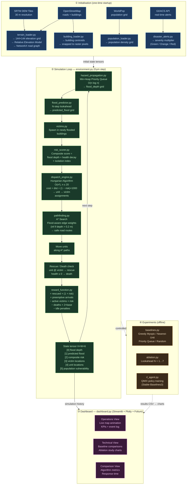

# DisasterAI — System Workflow Diagram



## Reading the diagram

| Phase | What happens | Key files |
|---|---|---|
| **① Init** | Geospatial data is downloaded once, parsed into grids and graphs | `terrain_loader.py`, `building_loader.py`, `population_loader.py`, `disaster_alerts.py` |
| **② Sim loop** | Every Gym `step()` runs the 10-stage pipeline in strict causal order | `environment.py` orchestrates all `env/` modules |
| **③ Dashboard** | Pre-recorded simulation history replayed client-side via Plotly frames | `dashboard.py`, `views/`, `components/` |
| **④ Experiments** | Baseline and ablation runs reuse the same Gym environment | `env/baselines.py`, `env/ablation.py`, `env/rl_agent.py` |

### Causal execution order (simulation loop)

```
Flood propagates
    → future flood predicted (N-step lookahead)
        → victims spawn in newly flooded buildings
            → composite risk scores updated
                → Hungarian dispatch solves unit→victim assignment
                    → A* computes safe routes per unit
                        → units advance one step along routes
                            → rescues and deaths evaluated
                                → reward calculated
                                    → 6-channel state tensor assembled
                                        → next step begins
```
